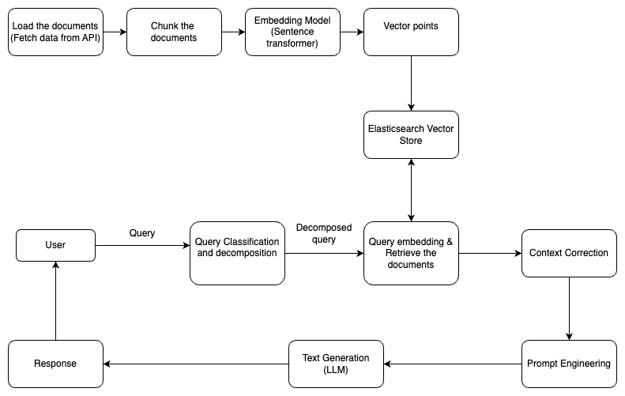
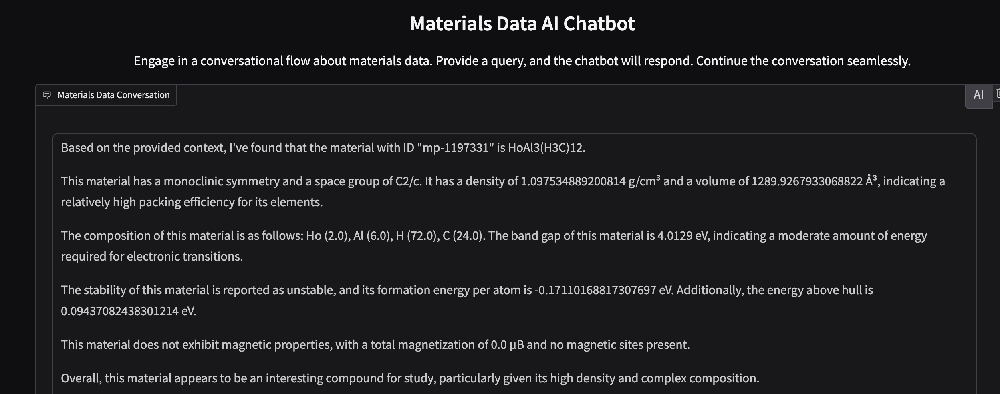
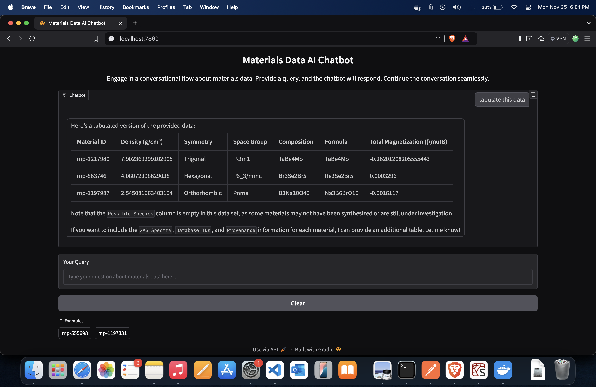
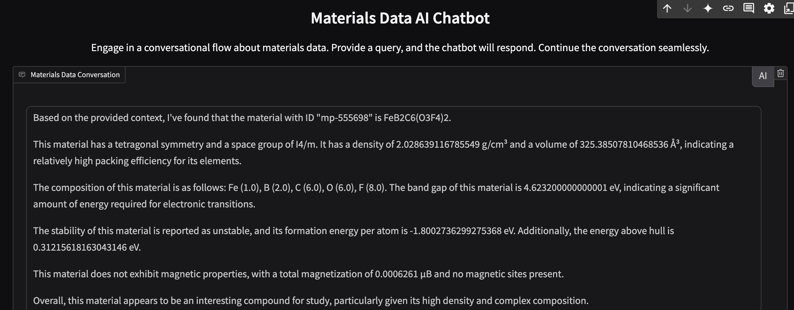
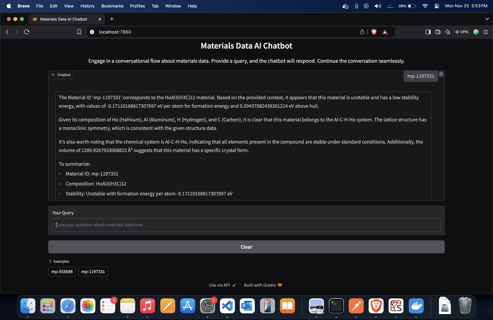

# Materials Data AI Chatbot

## Overview

The Materials Data AI Chatbot is an intelligent conversational interface designed to provide in-depth information about materials from the Materials Project database. Leveraging advanced AI technologies, this chatbot allows users to query and explore materials data seamlessly.

## Features

- Interactive chatbot interface powered by Gradio
- Real-time material data retrieval
- Contextual understanding of material queries
- Support for material ID and formula-based searches
- Semantic search capabilities
- Conversation history tracking

## System Architecture



## Material Project API endpoint
Materials summary endpoint is used to fetch information about the materials. A total of 1000 records were fetched, then 
chunked, embedded and then stored in the elasticsearch vector store.
- **URL**: `https://api.materialsproject.org/materials/summary`

## Interaction Options

You have multiple ways to interact with the Materials Data AI Chatbot:

### Option 1: Online Web Interface

Visit the Hugging Face Spaces hosted version of the chatbot:
- **Link**: [https://huggingface.co/spaces/Simanta100/material-chatbot](https://huggingface.co/spaces/Simanta100/material-chatbot)

**Advantages**:
- No installation required
- Instant access
- Cloud-hosted environment

### Option 2: Docker Deployment (Recommended for Local Setup)

#### Prerequisites

Ensure you have the following installed:
- Docker
- Docker Compose
- Git

#### 1. Clone the Repository

```bash
git clone https://github.com/simantapoudel/material-chatbot.git
cd material-chatbot
```

#### 2. Configure Environment Variables (<font color="red">Skip this step</font> as it is already provided to make it easier for you)

Create a `.env` file in the project root with the following variables:

```
# Materials Project API Configuration
MATERIAL_PROJECT_API_KEY=your_materials_project_api_key

# Elasticsearch Configuration
ELASTICSEARCH_URL=your_elasticsearch_url
ELASTICSEARCH_USERNAME=your_elasticsearch_username
ELASTICSEARCH_PASSWORD=your_elasticsearch_password
```

#### 3. Build and Run with Docker Compose

```bash
# Build and start the application
docker-compose up --build

# Or run in detached mode
docker-compose up -d --build
```

#### 4. Access the Chatbot

Open a web browser and navigate to:
- `http://localhost:7860`

#### 5. Stopping the Application

```bash
# Stop and remove containers
docker-compose down

# Remove volumes (optional)
docker-compose down -v
```

### Option 3: Traditional Local Setup

#### Prerequisites

Ensure you have the following installed:
- Python 3.8 or higher
- pip
- Git
- Virtual environment tool (venv recommended)

#### 1. Clone the Repository

```bash
git clone https://github.com/simantapoudel/material-chatbot.git
cd material-chatbot
```

#### 2. Create a Virtual Environment

```bash
# Create virtual environment
python -m venv venv

# Activate the virtual environment
# On Unix or MacOS
source venv/bin/activate

# On Windows
venv\Scripts\activate
```

#### 3. Install Dependencies

```bash
pip install -r requirements.txt
```

#### 4. Configure Environment Variables (<font color="red">Skip this step</font> as it is already provided to make it easier for you)

Create a `.env` file in the project root with the following variables:

```
# Materials Project API Configuration
MATERIAL_PROJECT_API_KEY=your_materials_project_api_key

# Elasticsearch Configuration
ELASTICSEARCH_URL=your_elasticsearch_url
ELASTICSEARCH_USERNAME=your_elasticsearch_username
ELASTICSEARCH_PASSWORD=your_elasticsearch_password
```

#### 5. Prepare the Vector Database (Skip this step as vector database is already prepared and stored in elasticsearch)

Before running the chatbot, process and index the materials data:

```bash
python processing.py
```

#### 6. Run the Chatbot

```bash
python app.py
```

Open a web browser and navigate to:
- `http://localhost:7860`

## Example Queries

The chatbot supports various types of queries:

- Material ID: `mp-555698`
- Material Formula: `LiFePO4`
- Specific Questions: 
  - "Tell me about the band gap of this material"
  - "What are the magnetic properties?"
  - "Describe the crystal structure"

## Technology Stack

- **Frontend**: Gradio
- **Backend**: Python
- **Vector Database**: Elasticsearch
- **Embedding Model**: Sentence Transformers (all-mpnet-base-v2)
- **LLM**: Ollama with Llama3.2:1b
- **Containerization**: Docker

## Architectural Components

1. `app.py`: Gradio web interface and conversation management
2. `ask_llm.py`: AI-powered query processing and response generation
3. `preprocessing.py`: Data ingestion, chunking, and vector storage

## Screenshots

Below are some example screenshots of the Materials Data AI Chatbot in action:

### Screenshot 1: Material Details Display


### Screenshot 2: Tabulated Data


### Screenshot 3: Analysis of mp-555698


### Screenshot 4: Analysis of mp-1197331


## Troubleshooting

### Online Interface
- Check internet connectivity
- Refresh the Hugging Face Spaces page
- Ensure you're using a modern web browser

### Docker Deployment
- Ensure Docker and Docker Compose are correctly installed
- Verify all environment variables in the `.env` file
- Check container logs with `docker-compose logs`

### Local Setup
- Confirm Python and pip versions
- Ensure virtual environment is activated
- Verify Elasticsearch and LLM endpoint connectivity
- Check Materials Project API key permissions

## Future Enhancements

### Accuracy and Performance Improvements

The current version of the Materials Data AI Chatbot demonstrates promising capabilities in retrieving and interpreting materials data. However, I've identified several key areas for future development:

#### Addressing Model Hallucinations

- **Current Challenge**: The AI model occasionally generates responses that, while seemingly plausible, may not be entirely accurate or directly supported by the source data.

- **Planned Improvements**:
  1. **Enhanced Prompting Techniques**
     - Develop more precise prompt engineering strategies
     - Implement stricter context-binding mechanisms
     - Create more explicit instructions to minimize speculative responses

  2. **Advanced Embedding Strategies**
     - Refine semantic chunking approaches
     - Experiment with more sophisticated embedding models
     - Improve vector similarity search algorithms

  3. **Hallucination Detection**
     - Implement confidence scoring for generated responses
     - Add citation and source tracking for each piece of information
     - Develop mechanisms to flag potentially unreliable or speculative statements

#### Additional Future Enhancements

- **Model Upgrades**
  - Explore more advanced large language models
  - Integrate multiple knowledge sources

- **User Experience**
  - Add more interactive query suggestions
  - Develop a feedback mechanism for users to report inaccuracies
  - Create visualization tools for material properties

## Acknowledgements

- Materials Project for providing the materials data
- BioEngineering lab for Ollama for the language model
- Langchain for AI integration
- Gradio for the web interface
- Hugging Face for hosting the online interface
